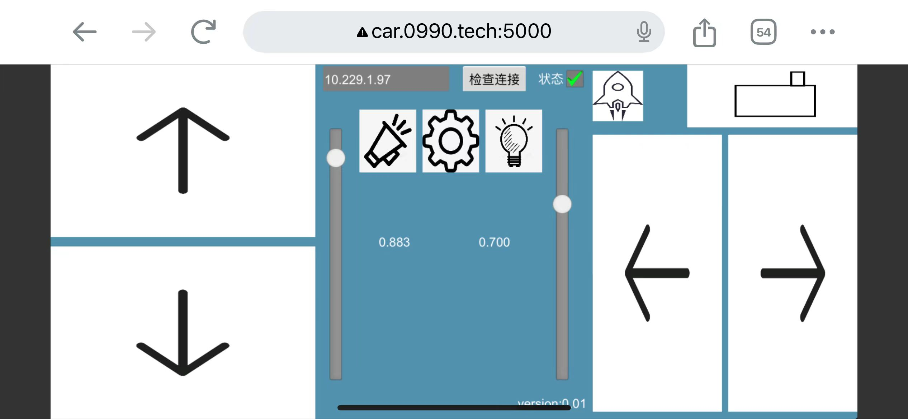

# esp32_car_control
esp32平衡车web控制界面
power by cocos creator3.8.3

## 界面

## 安装
可直接使用web端：
http://car.0990.tech:5000/

android平台可下载apk安装： https://github.com/0990/esp32_car_control/releases/download/v0.0.1/SelfBalanceCar-release.apk

## 使用方法
1，打开平衡车电源开关，陀螺仪会自动校准（保持不动即可，小车不用保持水平） 
2，几秒后，小车会抖动一下，表示启动成功，此时小车会创建esp32开头的AP站点 
3，手机wifi连接小车AP 
4， 控制界面上ip栏填入192.168.4.1,点击检查连接，右边状态按钮选中，代表连接成功，可以愉快的玩了

## 参照
https://www.instructables.com/DIY-ESP32-Wifi-Self-Balancing-Robot-B-Robot-ESP32-/ 
此为原项目地址，原项目有个控制app,但带有广告，所以自己重写了个，功能基本一致

## 说明
控制界面中设置功能用于设置小车平衡参数，一般不用动，建议高级用户去使用

